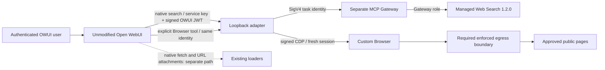

# AgentCore web capabilities — experimental integration work

**Not deployed, not release-ready, and not enabled by `deploy.sh`.** This package
contains contract-tested adapter code and a design candidate. It does not establish
working application-to-AWS calls, safe Browser networking, authenticated UI behavior, or
support across all model lanes. Do not enable it based on these offline tests.

Research cutoff: **2026-09-15**. Investigated Open WebUI **v0.11.3**, source
[`2a960a59fe1dbbd35282f0556b3666d81102e781`](https://github.com/open-webui/open-webui/tree/2a960a59fe1dbbd35282f0556b3666d81102e781).
The deployment script normally resolves the newest upstream release; the bare CDK
fallback is v0.11.0. These are different version-selection paths. Pin the tested
image digest before an eventual deployment; do not upgrade the application as a
side effect of enabling search.

## Recommendation and boundaries

Use a **hybrid** rather than pretending every HTTP hook carries user identity:

- Native `search_web` → external search provider → signed-user adapter → dedicated
  IAM-authenticated MCP Gateway → managed Web Search connector `web-search` 1.2.0.
- Explicit `browser_fetch_url` Python Tool → signed-user adapter → fresh custom
  AgentCore Browser session → deterministic bounded text extraction.
- Preserve ordinary native URL loading as a distinct path until its URL/network
  policy is verified. Do not configure the global external loader as Browser and
  infer its caller from the preceding search.

Open WebUI owns the model/tool loop; neither adapter runs a reasoning agent.
Search finds indexed snippets, Browser renders pages, and OWUI selects model context
and renders/persists source events. Browser is not a search index or article parser.
No Open WebUI fork, runtime source patch, or new agent framework is included.



**Important native gap:** in v0.11.3 the `builtinTools.web_search` gate enables both
`search_web` and `fetch_url`. There is no separately verified model setting to remove
only native fetch. Adding the explicit Browser tool does not enforce Browser-only
loading, common egress policy, or common attribution on the other paths. This is a
release gate, not a problem solved by telling a model which tool to prefer.

## Pinned contracts

| Path | Contract | Identity and limits |
|---|---|---|
| External search | POST `{query, count}`; bare array `{link,title,snippet}` | Static bearer plus signed OWUI user JWT; admin count defaults to 3; requested native count is applied after provider dispatch |
| External loader (not enabled here) | POST `{urls:[...]}`; bare array `{page_content,metadata}` | Static bearer only; batches of 20; no user token or chat identity |
| Explicit Browser adapter | POST `/browser` with `{url}`; `{text,title,requested_url,final_url,truncated,...}` | Static bearer AND verified OWUI JWT; one fresh session/context per load |
| Managed search | MCP `tools/call`, `TARGET___WebSearch`, `{query,maxResults}` | Query at most 200 characters; count 1–25; connector explicitly versioned; IAM downstream |

OWUI search response conversion discards extra metadata. The pure AWS normalizer
preserves optional dates, source metadata and MCP provenance internally, but the
native adapter returns only the three supported fields. Missing source URLs are
omitted and counted internally, not invented. The native hook cannot expose that
omission count or a structured error: it catches HTTP/parser failures and returns
`[]`. The adapter has bounded requests and useful HTTP errors, but cannot change
that upstream UI limitation. No claim of complete metadata preservation is made.

Native `search_web` returns snippets directly rather than creating its own vector
store. Legacy search can load, chunk/embed and persist retrieved material. Native
`fetch_url` returns text and derives citation identity from the requested URL,
discarding loader metadata; a positive `WEB_FETCH_MAX_CONTENT_LENGTH` bounds it,
but v0.11.3 has no configured default character cap. Direct URL attachment and
YouTube/binary extraction routes are not equivalent to the external HTML loader.

## Identity and service boundary

`FORWARD_USER_INFO_HEADER_JWT_SECRET` enables OWUI HS256 identity assertions with
`iss=open-webui`, `sub` equal to the OWUI user ID, `role`, `iat`, `exp`, email and
name. The adapter accepts only HS256, valid issuer/times, 300-second maximum
lifetime, and user/admin roles. It ignores plain user-ID headers. Both a separate
service bearer key and the signed identity are required; each secret must be at
least 32 bytes and they must differ. Signing-helper plaintext fallback is rejected.

This is **verified OWUI identity**, not the original Cognito access token, a
Cognito `sub`, or per-user IAM. AWS calls use the adapter/Gateway roles. Cross-ledger
Cognito joins and durable user-attributed usage accounting are not implemented.
Current admission is per-process: at most two concurrent users, one operation per
user at a time, five combined capability requests per minute per user, 1,024 tracked
subjects. Two ECS tasks have independent budgets. These are neither hard fleetwide
cost ceilings nor per-chat limits; reliable native chat IDs were not established.

The Python Tool receives trusted server-injected `__user__`; model arguments must
not contain identity, credentials, adapter endpoints or session identifiers. It
calls only loopback port 8090, never a model-supplied backend endpoint. Tool import,
read ACLs, model defaults and chat selection still require explicit configuration.

## Browser security gate

The extractor is deliberately marked **UNSHIPPABLE** pending enforced egress and
live CDP verification. Setting a readiness flag is an operator assertion, **not a
network security control**.

- Fresh custom Browser session, explicit 120-second AWS TTL, fresh context;
  no profiles, recordings, user cookies, uploads, clicks, forms or Live View.
- Exact approved HTTPS hosts; reject credentials, nonstandard ports, private/local
  IPs and DNS answers. DNS checks are not remote-browser address pinning.
- Context-wide request and WebSocket controls; service workers blocked; only
  GET/HEAD; no automatic fallback after denial, auth failure or timeout.
- Signed CDP is different from Playwright `connect()`: OWUI cannot use the AgentCore
  endpoint directly. Credentials and automation endpoints remain server-side.
- Playwright redirect handling can bypass route interception; rejecting a final
  redirected URL happens **after** navigation. Enforced egress must prevent forbidden
  destinations. PUBLIC Browser mode and a proxy option alone are insufficient.
- Fixed in-page extraction bounds returned text to 20,000 characters. It does not
  bound all downloaded bytes, browser CPU, or DOM memory. No full article-quality,
  PDF, iframe, follow-link or anti-bot extraction claim is made.
- Closing CDP is not stopping the AWS session. Cleanup attempts are bounded and
  shielded against cancellation; API failures can still leave sessions until TTL.
  Orphan detection, durable session accounting and cleanup alarms remain to build.

Do not introduce `route.fetch()` as the remote-browser network policy: it can shift
fetch work to the local Playwright API request path. This implementation uses
guarded continuation and explicitly leaves network enforcement as a release gate.

## Terms, privacy and costs

[AWS Web Search acceptable use](https://docs.aws.amazon.com/bedrock-agentcore/latest/devguide/gateway-target-connector-web-search-tool.md)
requires retaining/displaying source citations **and links** in outputs using
results. Bulk extraction, storage or reproduction and competing-index/database use
are prohibited. No universal connector retention TTL was established.

Do not bulk-ingest snippets or enable save-to-knowledge as an assumed entitlement.
The adapter stores no raw results, but OWUI history, exports, source events, vector
storage and logs are separate. In particular, v0.11.3 external search logs normalized
results at INFO. Audit effective logging, legacy RAG and persistence settings before
enablement. UI source events alone do not guarantee every model answer/export keeps
the required citations. Owner/legal interpretation of allowed retention is pending.

[Pricing accessed 2026-09-15](https://aws.amazon.com/bedrock/agentcore/pricing/):
Web Search $0.007/query; Gateway example $5/million tool invocations, charged
separately. Browser $0.0895/vCPU-hour + $0.00945/GB-hour. At a conservative 1 vCPU
and 4 GB for an entire 120-second session, Browser is approximately $0.004244/session
before networking, hosting and logging. Actual billed CPU/peak memory differs.
Ten queries plus six such sessions are about $0.096 in search/Browser service
components, not a complete infrastructure estimate or measurement. Restricted egress,
sidecar hosting, transfer, logs, model/context tokens and optional storage are extra.

## Delivered code and verification

| Files | Delivered responsibility |
|---|---|
| [`web_capabilities/search.py`](../web_capabilities/search.py) | Pure AWS result/input normalization and metadata preservation |
| [`web_capabilities/gateway.py`](../web_capabilities/gateway.py) | SigV4 MCP initialization/discovery/call, bounded JSON/SSE handling, correlation and opaque errors |
| [`web_capabilities/auth.py`](../web_capabilities/auth.py) | Service + signed OWUI identity verification |
| [`web_capabilities/app.py`](../web_capabilities/app.py) | Feature-gated native search and explicit Browser endpoints; bounded bodies and admission |
| [`web_capabilities/browser.py`](../web_capabilities/browser.py) | Experimental gated Browser lifecycle, policy checks and bounded extraction |
| [`web_capabilities/__main__.py`](../web_capabilities/__main__.py) | Loopback-only entrypoint; explicit region; both features default off |
| [`pipe/agentcore_browser_tool.py`](../pipe/agentcore_browser_tool.py) | Identity-aware explicit Tool, progress and citation events |
| [`web_capabilities/tests/`](../web_capabilities/tests/) and [`pipe/tests/`](../pipe/tests/) | Offline contracts, errors, security fixtures and existing Claude tool roundtrip regression tests |

Local verification (requires Python 3.11+; no AWS calls):

```sh
python -m pip install -r web_capabilities/requirements.txt pytest aiohttp requests cryptography
python -m pytest web_capabilities/tests pipe/tests metering/tests -q
node scripts/docs-integrity.mjs
cd infra
npm ci --ignore-scripts
npm run build
CDK_CONTEXT_JSON='{"cloudfrontPrefixListId":"pl-synthetic-offline"}' \
  CDK_DEFAULT_ACCOUNT="${SYNTHETIC_CDK_ACCOUNT:?Set a synthetic 12-digit account for offline tests}" CDK_DEFAULT_REGION=us-east-1 \
  AWS_EC2_METADATA_DISABLED=true npm test -- --runInBand
```

The supplied prefix-list/account values are **offline fixtures**, never deploy
configuration. Existing npm audit reports a high-severity transitive js-yaml issue;
this experiment does not upgrade unrelated dependencies. Mock tests prove contract
handling, not real AWS schema, Browser isolation, screenshots, latency, or lane support.

### Small live Browser contract probe

A separate cost-bounded lifecycle check used two 60-second AWS-managed Browser
sessions with no external URL navigation. Both were stopped and observed TERMINATED.
The first caught an incorrect mocked stream key; the real response uses
`streams.automationStream.streamEndpoint`. The corrected probe connected signed
CDP, created a fresh context, installed deny-all network/WebSocket hooks and rendered
fixed in-memory synthetic JavaScript using Playwright Python 1.58.0. This is one
successful CDP fixture, not an adapter, public-page, egress, IAM-scope or OWUI test.

## Remaining implementation and rollout

No IaC, automatic seeder, application settings, or deployment script changes are
included yet. Required work: reconcile authenticated configuration and recovery;
enforced egress design; service roles (including Browser stream action scoping);
separate version-pinned search target; reproducible sidecar image/dependency lock;
Secrets Manager injection; exact OWUI logging/persistence controls; trusted ToolForm
installation and restricted grants; model/channel tests; operation/session metrics;
full CDK diff review; staged live canary and rollback evidence.

An eventual ToolForm is `{id,name,content,meta,access_grants}`, installed through the
authorized tools API; OWUI derives owner/specs/timestamps. Do not fabricate ToolModel
database rows. New adapter variables use the `AGENTCORE_WEB_` prefix; they are not
upstream OWUI settings. Never put secrets into environment examples or commits.

Rollout must keep the tested upstream image fixed, preserve existing live overrides,
start disabled, verify existing Chat Completions/Responses/Messages lanes, then
exercise both services through authenticated OWUI. Disable features and restore
recorded settings/task definition on regression. No rollback was needed for this
experiment because no environment was changed.

## Official and pinned sources

- [OWUI traditional search](https://docs.openwebui.com/features/chat-conversations/web-search)
  and [agentic search](https://docs.openwebui.com/features/chat-conversations/web-search/agentic-search).
- [External search implementation](https://github.com/open-webui/open-webui/blob/2a960a59fe1dbbd35282f0556b3666d81102e781/backend/open_webui/retrieval/web/external.py#L13),
  [signed headers](https://github.com/open-webui/open-webui/blob/2a960a59fe1dbbd35282f0556b3666d81102e781/backend/open_webui/utils/headers.py#L36),
  [external loader](https://github.com/open-webui/open-webui/blob/2a960a59fe1dbbd35282f0556b3666d81102e781/backend/open_webui/retrieval/loaders/external_web.py#L11),
  [paired native tools](https://github.com/open-webui/open-webui/blob/2a960a59fe1dbbd35282f0556b3666d81102e781/backend/open_webui/utils/tools.py#L677).
- [Connector versions](https://docs.aws.amazon.com/bedrock-agentcore/latest/devguide/gateway-target-connector-versions.md),
  [Browser overview](https://docs.aws.amazon.com/bedrock-agentcore/latest/devguide/browser-tool.md),
  [signed CDP quickstart](https://docs.aws.amazon.com/bedrock-agentcore/latest/devguide/browser-quickstart-playwright.md),
  [Browser proxy limitations](https://docs.aws.amazon.com/bedrock-agentcore/latest/devguide/browser-proxies.md).
