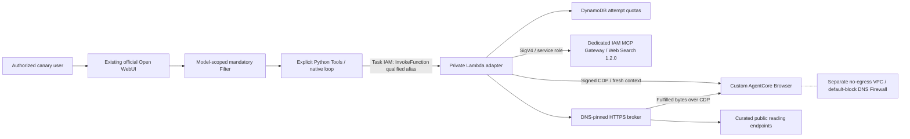

# AgentCore web capabilities: explicit native-loop canary

Status: experimental, public-read-only functional canary. Deployment and live
acceptance are separate from local contract tests. Do not enable for general users
or describe this as native-toggle integration merely because tool names match.
The original [native-provider experiment](AGENTCORE_WEB_CAPABILITIES.md) remains
disabled; its global-loader identity and native-fetch bypass limitations remain.

## Decision and compatibility

This implementation targets the **unmodified Open WebUI v0.11.3** image and
[source commit 2a960a5](https://github.com/open-webui/open-webui/tree/2a960a59fe1dbbd35282f0556b3666d81102e781).
It adds two explicit Python Tools, a mandatory model-scoped Filter, private canary
workspace models, and one IAM-invoked Lambda. No upstream fork, runtime monkey
patch, second research agent, MCP tool server, public adapter endpoint, or image
rebuild is required. The existing Open WebUI streaming loop owns orchestration.

Why not just set the native external endpoints? In this pin, the search hook can
forward an Open WebUI-signed user assertion, but the external loader cannot. The
native search switch also exposes native `fetch_url`; some attachment, binary and
YouTube paths bypass the loader. The search hook lacks a client deadline and logs
results at INFO. A generic adapter alone cannot repair those upstream behaviors.
The scoped explicit-tool option avoids claiming that it does.

| Journey | This canary |
| --- | --- |
| Native Web Search toggle | Remains globally off; not connected to this adapter |
| Traditional search/RAG | Unsupported; no automatic chunking, embeddings or knowledge writes |
| Streaming tool loop | Explicit `search_web(query,count=3)` and `fetch_url(url,render=false)` |
| Static URL reading | Bounded DNS-pinned HTTPS; does not start Browser |
| JavaScript URL reading | Explicit `render=true`; AgentCore Browser plus controlled extraction |
| Pasted URL | Text until the model invokes a Tool; not an automatic loader hook |
| URL/file attachments | Rejected in canary chat input; existing global ingestion APIs remain unchanged |
| Citations | Pinned native result extractor recognizes these names; search returns a JSON-string array, fetch plain text |
| Model protocols | Separate live proof required per enabled lane; protocol translation is not proof |

Source anchors: `backend/open_webui/utils/tools.py` (`get_tools` and builtin gates),
`backend/open_webui/utils/middleware.py` (`get_citation_source_from_tool_result`,
`streaming_chat_response_handler`), `backend/open_webui/tools/builtin.py`
(`search_web`, `fetch_url`), and `backend/open_webui/retrieval/web/external.py`.
The loop is streaming-only for this delivery. Its request-state iteration limit
is a pinned implementation dependency, **not an invented model parameter**.

## Components and trust

Open WebUI validates the login. Its server injects the authenticated OWUI subject
into the Tool, which constructs the Lambda payload. IAM authenticates the task,
not the user. Lambda **trusts this application attestation**, then independently
checks an exact subject allowlist. This is not the original Cognito token/sub or
a per-user AWS role. All code able to use the task role is inside this trust
boundary. No caller-supplied HTTP user header establishes authorization.

Both Tool and Lambda default closed. No AWS credentials, service tokens, browser
automation URLs, user cookies or OAuth tokens reach pages or ordinary clients.
The adapter has no Function URL/API Gateway endpoint and does not run in the
application VPC. Its public egress is through the HTTPS broker; the remote Browser
has a separate isolated VPC, no routable SG egress, and default-block DNS Firewall.
The reading feature flag is a master switch for both loaders; Browser has an
additional subordinate flag. HTTP can remain enabled while Browser is disabled.

The AWS managed browser sandbox remains trusted. Customer SGs do not control
microVM loopback or protect against browser-process compromise. This is a curated
synthetic-admin functional canary, not a general hostile-site browser or global
application SSRF fix. The filter runs after some upstream image processing and
does not intercept authenticated `/retrieval/process/*` APIs.

## Routing, content and spend controls

- Only vetted HTTPS443 host/path combinations; queries, credentials, IP literals,
  traversal/ambiguous paths and redirects are rejected. HTTP and Browser share
  exactly the same policy. No policy-bypassing fallback is implemented.
- Initial curated endpoints are `https://example.com/`, the public JavaScript
  demonstration at `https://quotes.toscrape.com/js/` and its three script/style resources, and
  the AgentCore developer-guide directory on `docs.aws.amazon.com`.
- Broker validates all DNS answers, pins the actual connection, preserves TLS
  host verification, strips browser credentials/headers, rejects encoded/download
  bodies, and bounds retained entity bytes. It never continues remote requests.
- Browser uses a fresh session/context, blocks service workers, sockets, popups,
  downloads and non-GET methods, and optionally aborts image/media/font resources.
  Explicit `Content-Disposition: inline` assets are accepted within the same MIME
  and byte limits; filename metadata is discarded. Attachments, unknown dispositions
  and ambiguous duplicate/list headers remain rejected before body reads.
  Out-of-policy stylesheets are aborted without DNS or HTTP fetching, rather than
  failing the whole document; approved stylesheets still pass through the broker.
  The Tool reports omitted optional resources and warns that rendering may differ.
  Main navigation, scripts and non-GET requests do not receive this exception.
  The browser executes the approved page's JavaScript; no autonomous action agent,
  clicks, forms, uploads, scrolling or authenticated browsing is supplied.
- Maximum 16 broker requests, 3 MiB retained page bytes, 1 MiB per response,
  20,000 extracted characters and 20 outgoing links. UTF-8 HTML/plain text only
  for primary documents; PDF/downloads and frame-text aggregation unsupported.
  Limits do not claim to bound every transport buffer or JavaScript DOM allocation.
- Fixed readiness wait is 500ms after DOMContentLoaded, not a guarantee every
  dynamic application has completed. Extraction chooses main, article, then body.
  Source title, requested/final URL, route, truncation, links and broker counts
  distinguish snippets from fetched/rendered content.
- Two concurrent Lambda executions maximum, four calls per chat request and
  three loop rounds; parallel model calls still consume individual reservations.
  DynamoDB reserves before paid work: per subject/day 10 search and 5 page reads;
  deployment/day 30 search and 15 reads; optional chat/day caps of 3 each.
  Static reads conservatively consume the page-read budget too.
- No automatic paid-call retries or refunds. Uncertain quota transactions fail
  closed. Counters are daily pseudonymous hashes/counts with eight-day TTL, not
  an inference billing ledger. Lambda60s, controller45s and Browser120s TTL bound
  work; normal cleanup stops the session and requires observed TERMINATED.
  A killed controller cannot promise immediate cleanup; TTL is the backstop.
  Each Lambda invocation receives a fresh quota transaction token, even when an
  operator repeats a correlation request ID; correlation is not free replay.

## Search contract and terms

The dedicated Gateway uses IAM inbound authentication, MCP `2025-03-26`, and the
AWS-managed `web-search` connector pinned to `1.2.0`. Tool name is
`web-search-tool___WebSearch`; discover and validate it rather than using a
similarly named harness tool. Search returns indexed links/snippets, not proof
that pages were fetched. Native result projection retains record metadata in the
model response, and unknown attribution-bearing shapes fail closed for review.

AWS's [connector guide and acceptable-use rules](https://docs.aws.amazon.com/bedrock-agentcore/latest/devguide/gateway-target-connector-web-search-tool.md)
require retaining/displaying supplied source citations and links and restrict
bulk storage/extraction or competing indexes. This canary does not embed or cache
search results or save them to knowledge. Ordinary chat/tool history may persist
in Open WebUI. Exports and privileged save-to-knowledge actions remain product
features; broader use/retention needs owner/legal interpretation, not a blanket
compliance assertion. Do not claim zero retention, no training, or same-region
processing without connector-specific authority. Retrieved text is untrusted data.

Pricing accessed **2026-09-15**: [AgentCore pricing](https://aws.amazon.com/bedrock/agentcore/pricing/)
lists search at $0.007/query and a Gateway example at $5/million InvokeTool calls.
Browser is $0.0895/vCPU-hour plus $0.00945/GB-hour; an illustrative full allocation
of 1vCPU/4GB for120s is about $0.00424/session, not a measured bill or allocation
guarantee. Thirty daily queries are $0.21 search-only; fifteen such illustrative
sessions are about $0.064 Browser-only. Add Lambda, DynamoDB, DNS Firewall queries,
logs, transfer, Gateway discovery and model/context tokens. No new NAT gateway,
load balancer or always-running adapter is introduced. Account quotas and actual
regional prices still require preflight inspection.

## Build, deploy and configure

1. Verify caller account/region, exact live task role, image/source pin, existing
   model lanes and recovery posture. This deployment path **does not deploy the
   original Compute/Auth/Gateway stacks** or overwrite their drift.
   Check the effective VPC quota (`vpc`, `L-F678F1CE`) and current regional VPC
   count before creating the dedicated Browser VPC. One unused slot is required;
   request history alone may lag the effective quota. Do not delete unrelated
   VPCs, reuse the application VPC, or weaken Browser isolation to bypass capacity.
   After a failed initial deployment, inspect retained-resource existence and
   resolve the failed stack before retrying the reviewed change set.
2. Prebuild the pinned search provisioner as described in
   [`gateway/web-search-provisioner/index.py`](../gateway/web-search-provisioner/index.py).
   Synthesize `infra/bin/web-capabilities.ts` with explicit `webCapabilities=on`,
   account, region and external `providerAssetPath`. Inspect a prepared change
   set for the new `OpenWebUI-WebCapabilities` stack before applying it.
3. Build the ARM64/Python3.12 Lambda bundle using
   `sh scripts/build-web-canary.sh /absolute/new/external/bundle`. It installs the
   hash-locked dependency set; no Browser binary or Docker image is built. Commit
   tested source before the final bundle so its source-commit marker is accurate.
4. Put verified account, region, Gateway ARN/URL, exact task-role ARN, authorized
   OWUI subjects, supported AZ ID and adapter bundle path in a **private** JSON
   configuration. Set `searchEnabled`, `fetchEnabled`, `browserEnabled` false.
   Synthesize `infra/bin/web-canary.ts` with `webCanary=on` and the absolute
   `canaryConfigPath`. Inspect all new resources and the one qualified-alias
   invocation policy attached to the existing task role; apply only the new stack.
5. Verify custom Browser READY, isolated route/SG/DNS policy and
   `GetFirewallConfig.FirewallFailOpen=DISABLED` before Browser enablement. The
   default is documented closed, but CFN currently cannot enforce this read-only
   resource type. Check the network service-linked-role prerequisite explicitly.
6. Enable only the reviewed new Lambda feature flags through the same private
   config and reviewed stack update. Keep global Open WebUI Web Search off.
7. Use `scripts/configure-web-canary.py` with the verified application origin,
   subject, region and qualified `:live` Lambda ARN. Supply the authorized admin
   token securely through `OWUI_ADMIN_TOKEN`, not a CLI argument. Default is a
   read-only plan; `--apply` installs only marked/owned canary objects. Explicit
   `--responses-model` selects an already-enabled non-default Responses lane;
   it never enables a connection or changes the model catalog.
   Explicit
   `--update-code` is required for source changes. Admin settings are not silently
   overwritten; changes to canary model settings require review.
8. Test both available streaming model lanes and inspect citations alongside
   Lambda/AWS evidence. Creating resources or seeing a Tool name is not success.
   Record Git commit, Lambda code digest/version, Tool/Filter source hashes,
   screenshots, service request IDs, test sample sizes and cleanup status privately.

Suggested synthetic prompts (after acceptance, not proof of deployment):

- “Search for the AgentCore Browser developer guide. Answer using snippets only;
  do not fetch pages. Cite the returned source links.”
- “Read `https://example.com/` using ordinary HTTPS. Do not start Browser.”
- “Use `fetch_url` with `render=true` for `https://quotes.toscrape.com/js/`.
  Quote the first visible quotation and cite the page.”

## Validation and rollback

Local contracts run with `python -m pytest web_capabilities/tests pipe/tests
gateway/web-search-provisioner/test_index.py metering/tests -q`; install
`web_capabilities/requirements-dev.txt` first. Infrastructure build/tests use the
repository npm commands and explicit offline CDK context. The dedicated workflow
has read-only GitHub permissions and no AWS credentials. Local passes are not CI
or live service results.

Rollback starts with the configurator's `--disable`: all Tool feature valves
close without deleting chat history, models, objects or existing configuration.
Then set the three Lambda feature flags false through the reviewed stack path.
Do not deactivate the mandatory Filter while leaving the Tools enabled. Restoring
the previous qualified Lambda version/source is separate from rolling back the
unchanged Open WebUI image. Quota table and logs are retained on stack deletion;
inventory them explicitly rather than promising complete resource cleanup.

Logs contain operation, request IDs, subject hashes, success, Browser start request
ID, cleanup confirmation and byte/request counts—not query/page text, source URLs,
tokens or cookies. Failure alarms have no automatic notification destination until
an operator configures one. Inspect session TTL/termination and detect lingering
sessions operationally; a scheduled orphan reconciler is not yet implemented.

Remaining work before broad release: enforceable native-toggle/attachment routing
or an upstream identity-aware loader extension, less restrictive policy validated
against adversarial fixtures, recording/Live View authorization if desired,
fleet operations/notifications, explicit service privacy/retention decisions, and
repeated upgrade/model-lane acceptance. Do not conflate this functional canary
with those follow-on capabilities.
